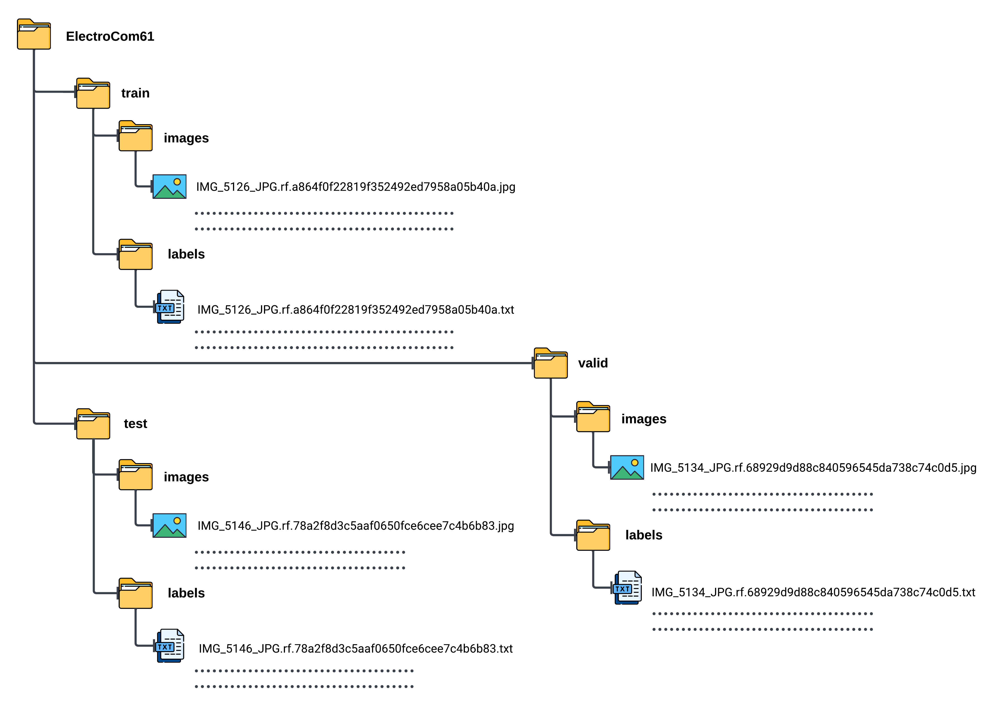
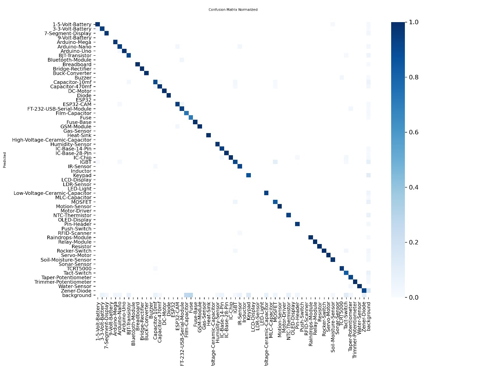

# YOLOV5m_ElectronicsComponents

Proyecto final de la materia Machine Learning, Universidad de Guanajuato, Junio 2025.

Enlace al video de YouTube -> https://youtu.be/zH5oiFn5MZ4

## Descripción 
Este proyecto tiene como objetivo reentrenar la arquitectura YOLOv5m para detectar componentes electrónicos en tiempo real. El modelo ha sido adaptado y entrenado con un conjunto de imágenes de diversos componentes, permitiendo su identificación automática en fotos o videos.

## Requisitos
- Python 3.8+
- ultralytics (YOLO y dependencias)

## Instalación

1. Clona este repositorio:
   ```bash
   git clone https://github.com/AndreRaz/YOLOV5m_ElectronicsComponents.git
   cd YOLOV5m_ElectronicsComponents
   ```

2. Instala las dependencias:
   ```bash
   pip install ultralytics
   ```

## Uso

1. Ejecuta el notebook principal para entrenamiento y pruebas:
   [YoloV5mColab](YOLOV5m_ElectronicsComponents.ipynb)

2. (Opcional) Para realizar inferencia en imágenes propias, puedes usar el siguiente fragmento en un notebook:
   ```python
   from ultralytics import YOLO
   model = YOLO('ruta/a/tu/modelo.pt')
   results = model('ruta/a/tu/imagen.jpg', show=True)
   ```

## Dataset
El dataset utilizado para este repositorio es el dataset ElectroCom61 y lo puedes encontrar en [ElectroCom61](https://github.com/faiyazabdullah/ElectroCom61)
Y sigue la siguiente estructura 



## Resultados 


Y la matriz de confusión de nuestro modelo nos queda de la siguiente manera


## Referencias

- [YoloV5m](https://github.com/ultralytics/yolov5)
- [Documentación de YOLOv5 en español](https://docs.ultralytics.com/es/yolov5/)
- [YOLO Algorithm: Real-Time Object Detection from A to Z](https://kili-technology.com/data-labeling/machine-learning/yolo-algorithm-real-time-object-detection-from-a-to-z)
- [¿Qué es el reconocimiento de objetos? Tres cosas que es necesario saber](https://la.mathworks.com/solutions/image-video-processing/object-recognition.html)
- [YOLOv5 PyTorch TXT](https://roboflow.com/formats/yolov5-pytorch-txt)
- [ElectroCom61: A multiclass dataset for detection of electronic components](https://www.sciencedirect.com/science/article/pii/S2352340925000630)
- [Explicación de la detección de objetos YOLO](https://www.datacamp.com/es/blog/yolo-object-detection-explained)

## Licencia

Este proyecto se distribuye bajo la licencia MIT. Consulta el archivo [LICENSE](LICENSE) para más detalles.


## Referencias

[YoloV5m](https://github.com/ultralytics/yolov5)
[Documentación de YOLOv5 en español](https://docs.ultralytics.com/es/yolov5/)

