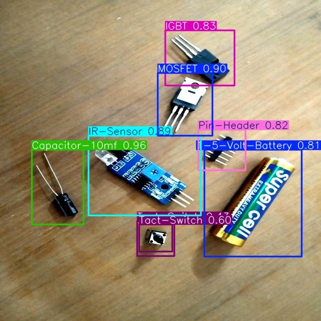
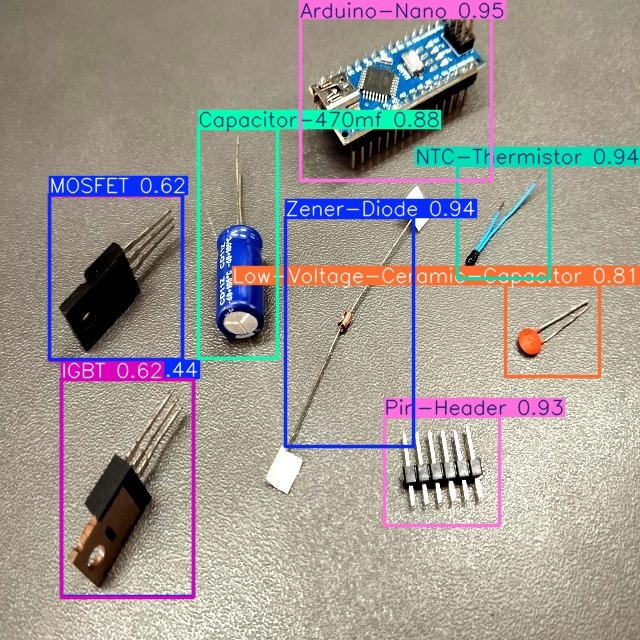

# YOLOV5m_ElectronicsComponents
Proyecto final de la materia Machine Learning, Universidad de Guanajuato, Junio 2025

## Descripción 
Este proyecto tuvo como objetivo el reentrenar la arquitectura YOLOv5m para detectar
componentes electrónicos en tiempo real. El modelo ha sido adaptado y entrenado con un conjunto
de imagenes de diversos componentes, permitiendo su identificación automática en fotos o videos.

## Requisitos
1. YOLO y sus dependencias
2. Python 3.8+

## Instalación

1. Puedes clonar este repositorio
```bash
git clone https://github.com/AndreRaz/YOLOV5m_ElectronicsComponents.git
cd YOLOV5m_ElectronicsComponents
```

2. Para instalar las dependencias
```python
pip install ultralytics
import torch

```

## Uso

1. Ejecura el notebook principal para entrenamiento y pruebas
[YoloV5mColab](YOLOV5m_ElectronicsComponents.ipynb)

#Resultados 





## Referencias

[YoloV5m](https://github.com/ultralytics/yolov5)
[Documentación de YOLOv5 en español](https://docs.ultralytics.com/es/yolov5/)

